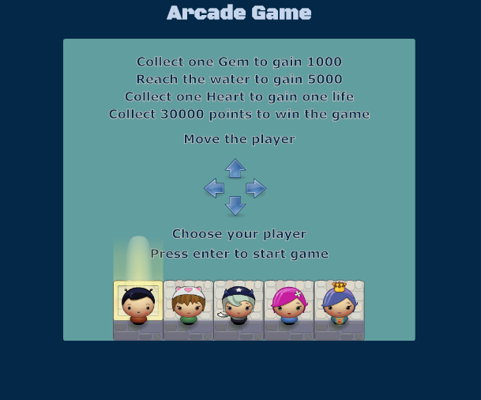
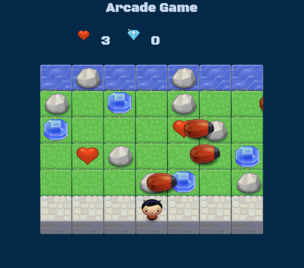

# Classic Arcade Game Clone

## What is the Arcade Game Clone
This is a simple game built to test a player's abilities to move quickly when face with dangerous bugs.

	

	

## Link to Play
Tap this link to start playing the arcade game https://romklao.github.io/frontend-nanodegree-arcade-game/

## Challenge
Collect 30,000 points to win the game.

### How to Play the Game

- Use the arrows to highlight which player you wish to use.
- Press Enter to choose your player and start the game.
- To play the game, use the arrow keys from your keyboard to move your player.

### Game Rules

-	Goal is to collect 30,000 points to win the game.
- 	You cannot move through rocks, but bugs can.
-	Avoid touching bugs.
-	If you touch a bug your points are decreased by 2,000 and if you have no lives the game is over.
-	You can collect Gem(s) to gain 1,000 points.
-	When you reach water, your points will increase by 5,0000.
-	If your points are less than 0, the game is over.
- 	You can pick up Heart(s) to increase your lives by +1.

